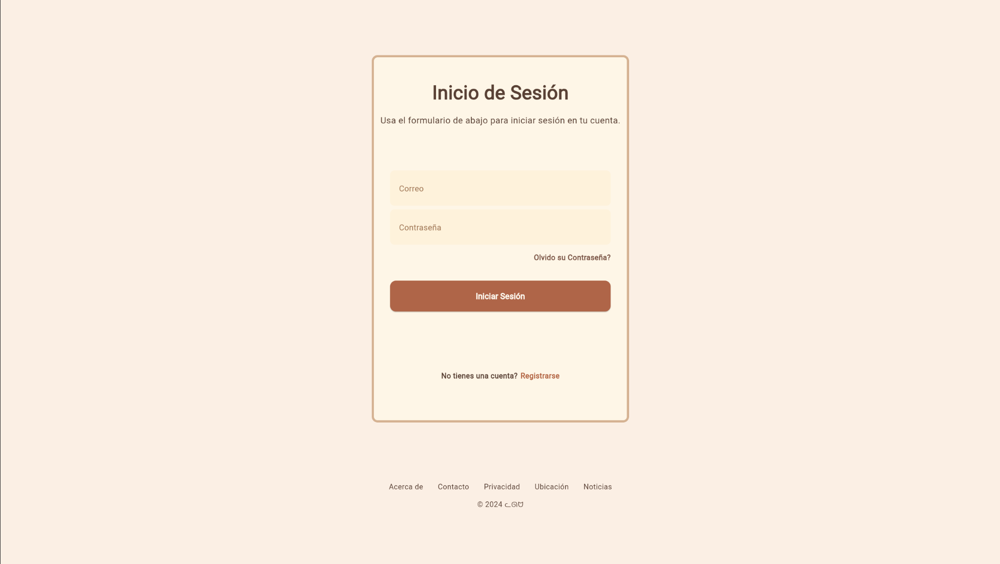
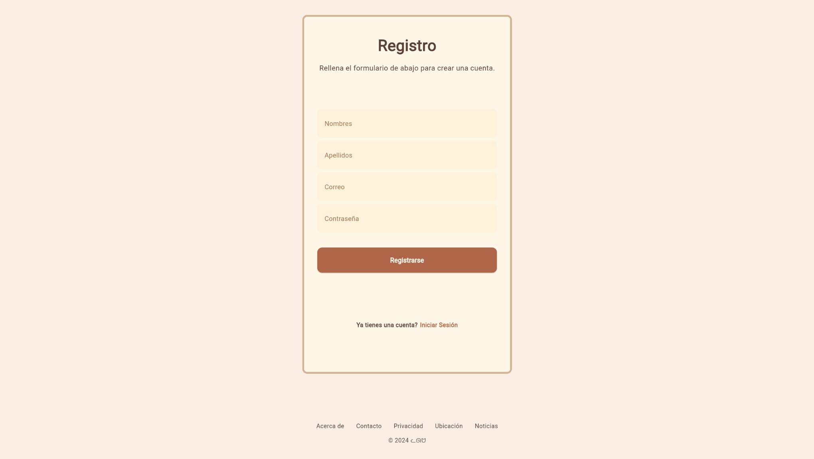
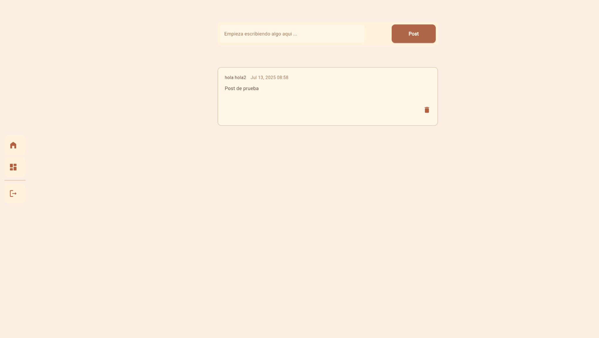
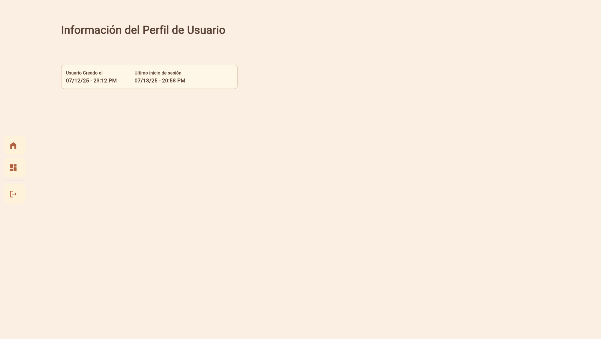
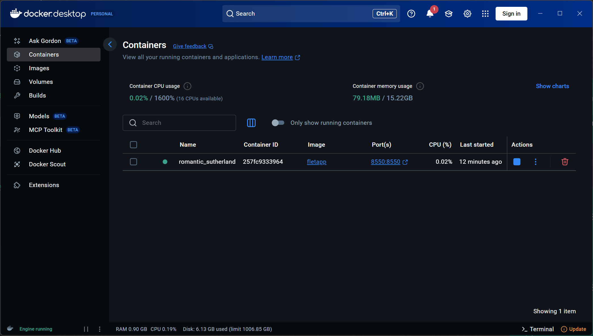

# app-web-flet
## Descripción general del proyecto.
El propósito de esta aplicación web es la de crear una interfaz fácil de utilizar en donde se puede integrar con cualquier base de datos que el usuario prefiera usar, partes del código está segmentado en diversos módulos(controles), para su fácil reutilización por la página, mientras que las funciones están almacenadas en un solo archivo.
Esta aplicación tiene como funcionalidad principal la ***creación de notas tipo posts***, similares a los comentarios hechos dentro de un foro, en donde un usuario se puede registrar e iniciar sesión para administrar sus notas. Permite la creación, edición y eliminación de estas (CRUD básico). 
## Instrucciones de ejecución o acceso.
Pasos para ejecutar:
1. Ir al directorio donde esta el Dockerfile y el archivo main.py
2. Ejecutar los siguientes comandos: 
    docker build -t fletapp .  
    docker run -p 8550:8550 fletapp
3. Ir a http://localhost:8550/
## Capturas de pantalla de la ejecución y despliegue.
- **Login**

- **Registro**

- **Index**

- **Perfil**

- **Despliegue**

## Link al sitio.
[App de notas](//localhost:8550/)

## Distribución del trabajo (integrantes).
> Adaptación del proyecto original creado por Nicolás González
+ Documentación técnica - _Erika Benítez_
+ Validaciones en autenticación - _Erika Benítez_
+ Rediseño de interfaz con colores cálidos - _Nicolás González, Erika Benítez_
+ Encapsulamiento con Docker - _Nicolás González_
